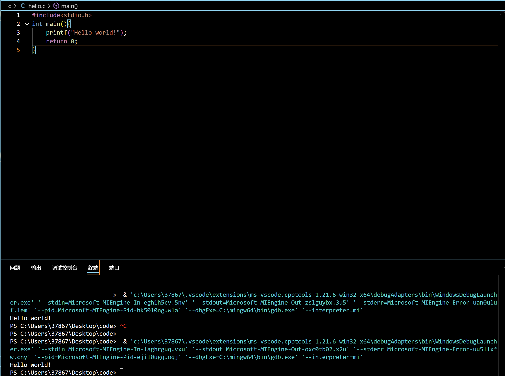
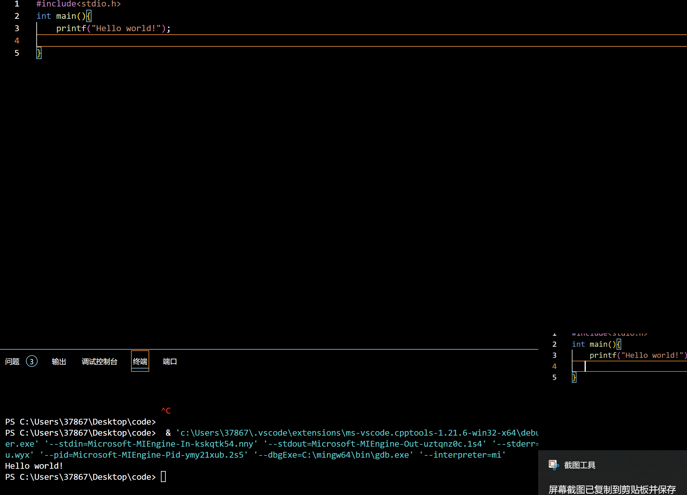
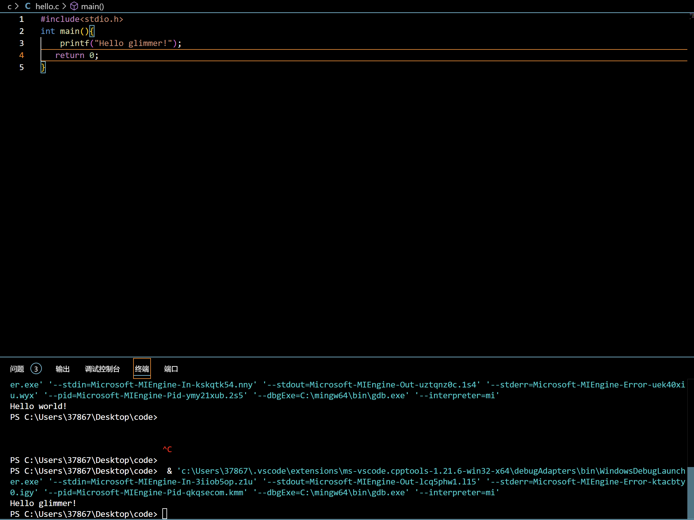
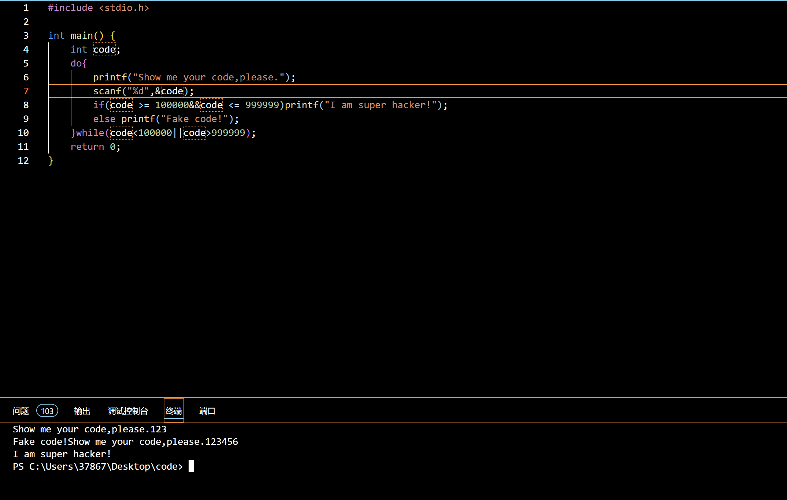

**第一个程序**

1.高级计算机语言:
①优点:通用性高，编程效率高，容易被程序员读懂，让程序员集中精力解决问题本身不被机器制约
②缺点:源程序需翻译成机器语言运行，程序效率较低
 低级计算机语言(机器语言及汇编语言):
①优点:通用性底，编程效率低，难让人理解
②缺点:程序代码不需要翻译或翻译较容易，占用空间少，程序效率较高
2.第一、二、四、五行:C语言的固有格式
第三行:输出语句hello world!
3.第四行

4.①储存整数型元素
  ②因为C语言规定main函数只能返回整数类型的状态码
5.

**基础语法运用**

**课后题**
